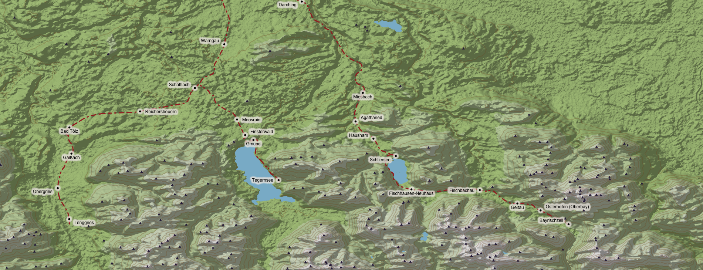
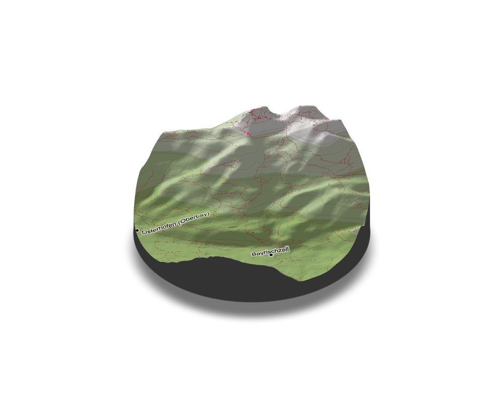

<style type="text/css">
.main-container {
  max-width: 1800px;
  margin-left: auto;
  margin-right: auto;
}
</style>

## Open Street Map Data and Elevation

```{r setup, include=FALSE}
knitr::opts_chunk$set(message = FALSE,warning = FALSE)
rm(list=ls())
library(pacman)
p_load(tidyverse,elevatr,sf,rayshader,raster,terra,osmdata,parallel,dodgr,reactable)

# https://www.tylermw.com/posts/data_visualization/adding-open-street-map-data-to-rayshader-maps-in-r.html
# https://norbertrenner.de/osm/bbox.html
```
The goal of this project is mainly to practice using OpenStreetMap data and calculate optimal routes on networks such as streets. To get some experience in this area, I want to answer the question from which train station in my area I can ascend 500 meters (or 750/1000m) in elevation with the least distance covered.

First, I load train stations and railway lines from OpenStreetMap in the bounding box of interest which represent train stations in the local mountains which I can reach within roughly an hour.

```{r test, echo=F}
# To manually get the correct bounding box from a map

# https://norbertrenner.de/osm/bbox.html

brb_bbox=	c(11.513,47.615,12.081,47.881)

# Get brb netowrk from osm
brb_netz <- opq(bbox =brb_bbox) %>%  add_osm_features(features=list("railway"="rail",
                                                                    "public_transport"="station")) %>% 
  osmdata_sf()

brb_stations <-  brb_netz$osm_points %>% filter(!is.na(name)&train=="yes") 
# Remove stations which are inside the bounding box but don't belong to the routes of interest 
# (in the Northeastern quadrant, train towards Rosenheim)
brb_stations <- brb_stations %>% cbind(st_coordinates(brb_stations)) %>% filter(!(X>11.85&Y>47.84)&X<12.04)
# Remove duplicate station points
brb_stations <- brb_stations %>% group_by(name) %>% filter(row_number()==1) %>% ungroup()
# Remove some more duplicates which have a second platform
brb_stations <- brb_stations %>% filter(!grepl(pattern="Gleis",name))
```

The area of interest looks as follows:

```{r echo=F, dpi=350,fig.fullwidth=TRUE}
# Now the railways for the plots
brb_rails <- brb_netz$osm_lines
# Cannot simply duplicate as with the points since the lines have multiple coordinates per line --> select one point by line
rail_cords <-st_coordinates(brb_rails) %>%data.frame() %>%  group_by(L1) %>% filter(row_number()==1)
brb_rails <- brb_rails %>%cbind(rail_cords) %>% filter(!(X>11.85&Y>47.84)&X<12.04)
ggplot(brb_rails)+geom_sf(lty="dashed")+geom_sf(data = brb_stations)+geom_sf_text(data = brb_stations,aes(label=name),nudge_x =0.026,nudge_y = 0.007,size=2.5 )+theme_classic()

```

Next, I want to load additional data on lakes and peaks from OSM for further plots and calculations.

```{r echo=F}
# Lakes come in both polygon and multipolygons in the osm data (depends on whether the lake is just one surface or has a smaller additional parrt)
lakes <- opq(bbox =brb_bbox) %>% add_osm_feature(key="water",value="lake") %>% osmdata_sf()
lakes_poly <- lakes$osm_polygons %>% filter(!is.na(name))
lakes_multi <- lakes$osm_multipolygons %>% filter(!is.na(name))


#Peaks

peaks <- opq(bbox =brb_bbox) %>% add_osm_feature(key="natural",value="peak") %>% osmdata_sf()
peaks_points <- peaks$osm_points %>% filter(!is.na(name))
peaks_points <- peaks_points %>% cbind(st_coordinates(peaks_points))
```

Then, I want to load elevation data for the bounding box which I am looking at using the package [elevatr](https://github.com/jhollist/elevatr).

```{r}
brb_elevation <- get_elev_raster(locations = brb_stations , z=11)
# Saving the coordinate reference system for potential later use
crs_elevation <- crs(brb_elevation)
# Elevatr downloads all necessary terrain tiles to cover the area, so I have to crop the loaded data to the bounding box.
brb_elevation_zoom <- crop(brb_elevation,extent(brb_bbox))

brb_elevation_mat <- raster_to_matrix(brb_elevation_zoom)
```

Next, I want to give a more intuitive visual representation of the area of interest including the elevation profile. To do this, I use the package [rayshader](https://www.rayshader.com).

```{r ,dpi=350,fig.fullwidth=TRUE,echo=F}
  lake_layer = generate_polygon_overlay(lakes_poly, extent = extent(brb_elevation_zoom),
                                                         heightmap = brb_elevation_mat, palette="#85b6ce",linecolor = "transparent") %>%
              add_overlay( generate_polygon_overlay(lakes_multi, extent = extent(brb_elevation_zoom),
                                                    heightmap = brb_elevation_mat, palette="#85b6ce",linecolor = "transparent") ) 
   
 plot_brb <-  brb_elevation_mat %>% 
    height_shade(texture = grDevices::colorRampPalette(c("#acc484","#f0eeed"))(4)) %>%
    add_shadow(lamb_shade(brb_elevation_mat),0.25) %>% 
    add_overlay(generate_contour_overlay(brb_elevation_mat, color = "#7d4911", 
                                         linewidth = 2, levels=seq(min(brb_elevation_mat), max(brb_elevation_mat), by=100)),alphalayer = 0.5) %>% 
    add_overlay(lake_layer) %>% 
    add_overlay(height_shade(brb_elevation_mat,texture = "white"), alphalayer=0.2) %>% 
    add_overlay(generate_line_overlay(brb_rails,extent = extent(brb_elevation_zoom),
                                      linewidth = 4, color="brown",lty=4, 
                                      heightmap = brb_elevation_mat)) %>% 
    add_overlay(generate_label_overlay(brb_stations, extent = extent(brb_elevation_zoom),
                                       text_size = 1, point_size = 1, color = "black", 
                                       halo_color = "#e6e1db", halo_expand = 5, 
                                       halo_blur = 2, halo_alpha = 0.8,
                                       seed=1, heightmap = brb_elevation_mat, 
                                       data_label_column ="name")) %>% add_overlay( generate_point_overlay(peaks_points, extent = extent(brb_elevation_zoom),
                                                                                                           heightmap = brb_elevation_mat,pch=17,size = 0.75,color="#312647") )

plot_brb %>% plot_map() 
```
<!-- {width="125%"} -->


### Calculating the optimal station
My first approach to find the station from which I can most directly ascend 500 meters is simply to find the distance to the closest point 500 meters higher than the respective station. This includes the following steps:

* Get the elevation data for the train stations; this is not always included in osm data, so I again use *elevatr*
* For each station:
    + Calculate the distance to each point in our elevation matrix
    + Calculate a boolean matrix whether each point in the elevation matrix exceeds the station elevation by a certain reference elevation gain (e.g. 750m).
    + Element-wise multiplication of the boolean and the distance matrix
    + Saving relevant information on the minimum distance point (distance to station, coordinates)


```{r}


# find minimum distance value in the distannce matrix by subsetting with the boolean matrix, keep coordinates (probably by keeping indices)


###
brb_stations <- get_elev_point(brb_stations,src="aws",z=12)


# Let's look at an elevation gain of 750m
elevation_gain=750

elev_one_row <- function(row,elevation_gain) {
  distance <- distanceFromPoints(xy=row,brb_elevation_zoom)
  distace_mat <- raster_to_matrix(distance)
  reference_altitude <- row$elevation+elevation_gain
  bool_elevation_gain <- brb_elevation_mat>=reference_altitude
  temp<- bool_elevation_gain*distace_mat
  temp[temp == 0]=NA
  c(min(temp,na.rm = T),xyFromCell(distance,which.min(temp)))
  
}
# To apply the mclapply function to each row, I split the data of the stations into a list of rows
brb_stations_list <- split(brb_stations, seq(nrow(brb_stations)))


# Slightly faster in parallel, but won't work on windows (just use standard lapply)
out <- mclapply(brb_stations_list,elev_one_row,elevation_gain=elevation_gain,mc.cores = 4)

out <- t(data.frame(out))

colnames(out) <- c(paste("distance",elevation_gain,sep = "_"),paste("lon",elevation_gain,sep="_"),paste("lat",elevation_gain,sep="_"))

# Combine with the original data
brb_stations <- cbind(brb_stations,out) 


```

The optimal station for 750 meters of elevation gain is: Osterhofen where you can ascend 750 m in 2.29 km:
```{r echo=F, results='asis'}
# brb_stations %>%dplyr::select(name,elevation,distance_750) %>% st_drop_geometry()%>% arrange(distance_750) %>% knitr::kable(row.names = F,col.names = c("Station name","Station elevation (m)","Distance to closest point 750 m higher (m)")) 


brb_stations %>% dplyr::select(name,elevation,distance_750) %>% st_drop_geometry() %>% reactable::reactable(
  bordered = T,
  highlight = T,
  rownames = F,
  defaultPageSize = 10,
  defaultSorted = list(distance_750="asc"),
  columns = list(
    name = colDef(name = "Station name", align = "left",filterable = T),
    elevation = colDef(name = "Station elevation (m)", format =colFormat(digits = 0)),
    distance_750 = colDef(name = "Distance to closest point 750 m higher (m)", format =colFormat(digits = 0))
  ))
```
Let's look at the winner station on a map. The winning point to reach is highlighted in pink.

```{r dpi=350,echo=F}
# plot winner station
# Probably want to add hiking trails to a subset of the map of the winner stations
winner_point <- brb_stations %>% filter(distance_750==min(distance_750))%>% dplyr::select(lon_750,lat_750) %>% st_drop_geometry()
winner_point <- st_as_sf(winner_point, coords = c("lon_750","lat_750"))

# Add walking paths for the plot and for later calculations
brb_paths <- opq(bbox =brb_bbox) %>% add_osm_features(features=list("highway"="footway",
                                                                    "highway"="path","highway"="track")) %>% osmdata_sf()


# Found again manually as above
winner_bbox =			c(11.9555,47.661,12.0565,47.7115)
# Have to do some manual adjustments to make the map look nice
locations <- data.frame(peaks_points%>% filter(name=="Breitenstein"|name=="Jackelberg")  %>% dplyr::select(X,Y) %>% st_drop_geometry())
locations <- locations %>% rbind(data.frame(brb_stations%>% filter(name%in%c("Bayrischzell","Osterhofen (Oberbay)","Geitau"))  %>% dplyr::select(X,Y) %>% st_drop_geometry()))
colnames(locations) <- c("x","y")
brb_elevation_winner <- get_elev_raster(locations = locations ,prj = crs_elevation, z=14)
brb_elevation_winner_zoom <- crop(brb_elevation_winner,extent(winner_bbox))
brb_elevation_winner_mat <- raster_to_matrix(brb_elevation_winner_zoom)

plot_winner <-  brb_elevation_winner_mat %>% 
  height_shade(texture = grDevices::colorRampPalette(c("#acc484","#f0eeed"))(4)) %>%
  add_shadow(lamb_shade(brb_elevation_winner_mat),0.25) %>% 
  add_overlay(generate_contour_overlay(brb_elevation_winner_mat, color = "#7d4911", 
                                       linewidth = 2, levels=seq(min(brb_elevation_winner_mat), max(brb_elevation_winner_mat), by=100)),alphalayer = 0.5) %>% 
  add_overlay(height_shade(brb_elevation_winner_mat,texture = "white"), alphalayer=0.2)   %>% 
  add_overlay(generate_label_overlay(brb_stations, extent = extent(brb_elevation_winner_zoom),
                                     text_size = 3, point_size = 3, color = "black", 
                                     halo_color = "#e6e1db", halo_expand = 5, 
                                     halo_blur = 2, halo_alpha = 0.8,
                                     seed=1, heightmap = brb_elevation_winner_mat, 
                                     data_label_column ="name")) %>% add_overlay( generate_point_overlay(peaks_points, extent = extent(brb_elevation_winner_zoom),
                                                                                                         heightmap = brb_elevation_winner_mat,pch=17,size = 3,color="#312647") ) %>% 
  add_overlay(generate_line_overlay(brb_paths$osm_lines,extent = extent(brb_elevation_winner_zoom),
                                    linewidth = 3.5, color="brown",lty=4, 
                                    heightmap = brb_elevation_winner_mat)) %>% 
  add_overlay( generate_point_overlay(winner_point, extent = extent(brb_elevation_winner_zoom),
                                      heightmap = brb_elevation_winner_mat,pch=4,size = 11,color="#FC46AA") )
  
  

  
# plot_winner%>%  plot_3d(brb_elevation_winner_mat,zscale = 2.5, fov = 0, theta = -9, phi = 36, windowsize = c(1000, 800), zoom = 0.6,baseshape = "circle")
# 
# render_snapshot(clear = TRUE,keep_user_par = T,filename = "osterhofen.png")
# render_camera()
```
{width="125%"}

I would now like to add two extensions to this simplistic solution: 

1. Expand on the arbitrary nature of a reference altitude by finding the best stations for an interval of altitude gains (100 m to 1000 m)
2. Drop the assumption that I can simply reach any point as the crow flies. Rather, I want to find the closest peak I can reach via hiking trails (see map above).

First, let's look at the first extension: 

```{r}
reference_altitude=seq(100,1000,100)

argument_list <- expand.grid(brb_stations$elevation,reference_altitude) %>% data.frame()
argument_list <- argument_list %>% mutate(reference_altitude=Var1+Var2)
## 1, 2, 3 .. at 100 hm then 1,2,3 ... at 200 hm and so on
distance_matrices_fun <- function(row) {
  distance <- distanceFromPoints(xy=row,brb_elevation_zoom)
  distace_mat <- raster_to_matrix(distance)
}

distance_matrices <-  mclapply(brb_stations_list,distance_matrices_fun,mc.cores = 4)


boolean_matrices_fun <- function(reference_altitude) {
  bool_elevation_gain <- brb_elevation_mat>=reference_altitude
}


boolean_matrices <-  lapply(argument_list$reference_altitude,boolean_matrices_fun)
distance_matrices <- rep(distance_matrices,10)

mapply_helper <- function(matrix_1,matrix_2){
  temp <- matrix_1*matrix_2
   temp[temp == 0]=NA
 out <- min(temp,na.rm = T)
}

min_distances <- mapply(mapply_helper, distance_matrices,boolean_matrices,SIMPLIFY = T)


 
  
  


# distances_Tegernsee <-min_distances[seq(which( grepl("Tegernsee",brb_stations$name)),210,21)] 
# distances_Geitau <-min_distances[seq(which( grepl("Geitau",brb_stations$name)),210,21)] 

names <- brb_stations$name %>% rep(10)

data_dist <- tibble(names,min_distances)

data_dist <- data_dist %>% cbind(rep(seq(100,1000,100),each=21))
colnames(data_dist) <- c("name","distance","altitude_gain")

data_dist <- data_dist %>% mutate(steepness=altitude_gain/distance)
```

We can now look at the steepness in the area surrounding the stations:

The highest steepness, i.e. altitude gain per distance, can be reached in Bayrischzell when gaining 700 m in elevation.

```{r echo=F,results='asis'}
# data_dist %>% dplyr::select(name,altitude_gain,steepness) %>%arrange( desc(steepness) )%>% head(10) %>% knitr::kable(row.names = F,col.names = c("Station name","Altitude gain","Steepness"))

data_dist %>% dplyr::select(name,altitude_gain,steepness) %>% reactable::reactable(
  bordered = T,
  highlight = T,
  defaultPageSize = 10,
  defaultSorted = list(steepness="desc"),
  columns = list(
    name = colDef(name = "Station name", align = "left",filterable = T),
    altitude_gain = colDef(name = "Altitude gain (m)",filterable = T, format =colFormat(digits = 0)),
    steepness = colDef(name = "Steepness",format=colFormat(percent = T,digits = 2))
  ))
```

However, as the following plot shows, Bayrischzell is not the most efficient station at all altitude gains. Up to 400 meters, it takes less distance starting at the station Tegernsee:

```{r echo=F,dpi=350, fig.fullwidth=TRUE}

# Still have to think about switching x and y axis
data_dist %>% filter(name=="Tegernsee"|name=="Bayrischzell") %>% ggplot(aes(x=altitude_gain,y=distance,color=name))+geom_line()+ theme_bw()+scale_y_continuous(trans='log10')+scale_x_continuous(breaks=seq(100,1000,100))+xlab("Elevation Gain")+ylab("Distance")+ggtitle("Steepness at given elevation gain")
```

The highest average steepness still belongs to Bayrischzell though as this table shows:
```{r echo=F,results='asis'}
 # data_dist %>%
 #  group_by(name) %>%
 #  summarise(mean = mean(steepness)) %>% arrange(desc(mean) ) %>% knitr::kable(row.names = F,col.names = c("Station name","Average steepness"))


data_dist %>%  group_by(name) %>%
  summarise(mean = mean(steepness))%>%
  reactable::reactable(
  bordered = T,
  highlight = T,
  defaultPageSize = 10,
  defaultSorted = list(mean="desc"),
  columns = list(
    name = colDef(name = "Station name", align = "left",filterable = T),
    mean = colDef(name = "Mean steepness",format=colFormat(percent = T,digits = 2))
  ))

```
As for the second extension, this table shows the peak at least 1000 meter higher than the respective stations which is closest along the trail network.
```{r echo=F }
#####
# Now: find the peak at least 500m above each station which I can reach the fastes by hiking on actual trails:
# Download peak data from osm
# Add elevation data to and sc object with osm_elevation. Probably need to write the elevation data to file first
#  Select the corresponding to files by using the reference altitude with the peaks (perhaps filter peaks far away to save time)
# Use dodgr to route from station to selected peaks (why peaks: - summit -need defined to points)
# Perhaps can add minutes in train on.


# peaks downloaded above as peak_points, add elevation data
# The elevation data is not exactly correct, but I don't want download at higher resolution/should also not be the biggest problem
peaks_points <- get_elev_point(peaks_points,src="aws",z=12)
peaks_points <- peaks_points %>% mutate(ele=as.numeric(ele))
peaks_points <- peaks_points %>% mutate(elevation=if_else(is.na(ele),elevation,ele))

###


# Could do this by writing the elevation file from above and adding it in via osm_elevation, but some missing z values in the vertex file which we would likely have to impute
# first, save elevation to file as .tif:
# writeRaster(brb_elevation_zoom,'brb_elvation_zoom.tif',options=c('TFW=YES'))


## --> Try downloading the data from: https://portal.opentopography.org/raster?opentopoID=OTSRTM.082015.4326.1 by entering the coordinates from our bounding box "47.615,11.513,47.881,12.081"


# For dodgr, we need to download all the key="highway" osmdata which are used in the weighting profile for "foot"

brb_highway_sc <- opq(bbox =brb_bbox) %>% add_osm_feature(key="highway") %>% osmdata_sc()

brb_highway_sc <- osm_elevation(brb_highway_sc,"output_SRTMGL1.tif")
# ~1.9% missing z_  at this point


brb_highway_graph <- weight_streetnet(brb_highway_sc,wt_profile = "foot",turn_penalty = F)


## Now: function for mclappply:

# calculate distance matrix to restrict routing to peaks which are somewhat close perhaps to closest 10 peaks? 
from <- data.frame(brb_stations%>% dplyr::select(X,Y) %>% st_drop_geometry())
to <- data.frame(peaks_points %>% dplyr::select(X,Y) %>% st_drop_geometry())

# want to iterate over the from values
              # peak_one_row <- function(row,elevation_gain,n_peaks) {
              #   reference_altitude <- row$elevation+elevation_gain
              #   temp <- from_to_matrix %>% filter(osm_id==row$osm_id) %>% dplyr::select(-osm_id)
              #   temp <- peaks_points %>% mutate(distance_rank=rank(temp))
              #   temp <- temp %>% filter(elevation>=reference_altitude)
              #   # Have to calculate rank again here to get rank among those peaks higher than the reference_altitude (probably can improve this)
              #   temp <- temp %>% mutate(distance_rank=rank(distance_rank))
              #   temp <- temp %>% filter(distance_rank<=n_peaks)
              #   to <- data.frame(temp %>% dplyr::select(X,Y) %>% st_drop_geometry())
              #   from <- row %>% data.frame() %>% dplyr::select(X,Y) %>% st_drop_geometry()
              #   distances<- dodgr_distances (brb_highway_graph, from = from, to = to, shortest = T)
              #   distances
              # }
              # 
              # out <- mclapply(brb_stations_list[1:2],peak_one_row,elevation_gain=500,n_peaks=5,mc.cores = 4)

times_to <- dodgr_distances (brb_highway_graph, from = from, to = to, shortest = T)
# Have literally zero clue why the fuck this does not work
not_work <- peaks_points %>% filter(!osm_id%in%colnames(times_to))
to_not_work <- not_work  %>% dplyr::select(X,Y) %>% st_drop_geometry()
times_not_work <- dodgr_distances (brb_highway_graph, from = from, to = to_not_work, shortest = T)
combine <- cbind(times_to,times_not_work)
# Find out why some peaks only have NAs, these seem to mostly not paths
only_na <- colnames(combine)[!complete.cases(t(combine))]
peaks_points %>% filter(osm_id==1200501391) %>% view()

# Sort combine in the order of the the peak_points data
combine <- combine[ , peaks_points$osm_id]
#### Does not exactly work yet
# make altitude difference matrix/booleamatrix
reference_altitude_boolean_matrix <- -outer(brb_stations$elevation,peaks_points$elevation,"-") >1000
temp<- reference_altitude_boolean_matrix*combine

temp[temp == 0]=NA

brb_stations$min_dist_peak <- apply(temp, 1, FUN = min, na.rm = TRUE)
brb_stations$min_dist_peak_index <- apply(temp, 1, which.min)
# Still want to get the names and the coordinates, and elevation (distance)
brb_stations$min_dist_peak_name <- peaks_points[brb_stations$min_dist_peak_index,]$name
brb_stations$min_dist_peak_elevation <- peaks_points[brb_stations$min_dist_peak_index,]$elevation
brb_stations <- brb_stations %>% mutate(min_dist_peak_elevation_difference=min_dist_peak_elevation-elevation)
```


```{r echo=F, results='asis' }
# brb_stations %>% dplyr::select(name,min_dist_peak_name,min_dist_peak,min_dist_peak_elevation_difference) %>% st_drop_geometry() %>% arrange(min_dist_peak) %>% knitr::kable(row.names = F,col.names = c("Station name","Peak name","Distance","Elevation distance"))


brb_stations %>%
  dplyr::select(name,min_dist_peak_name,min_dist_peak,min_dist_peak_elevation_difference) %>% 
  st_drop_geometry() %>%
  reactable::reactable(
  bordered = T,
  highlight = T,
  rownames = F,
  defaultSorted = list(min_dist_peak="asc"),
  defaultPageSize = 10,
  columns = list(
    name = colDef(name = "Station Name", align = "left",filterable = T),
    min_dist_peak_name=colDef(name = "Peak name",filterable = T),
    min_dist_peak = colDef(name = "Distance to peak (m)", format =colFormat(digits = 0)),
    min_dist_peak_elevation_difference = colDef(name = "Altitude gain to peak (m)", format =colFormat(digits = 0))
  ))
```


